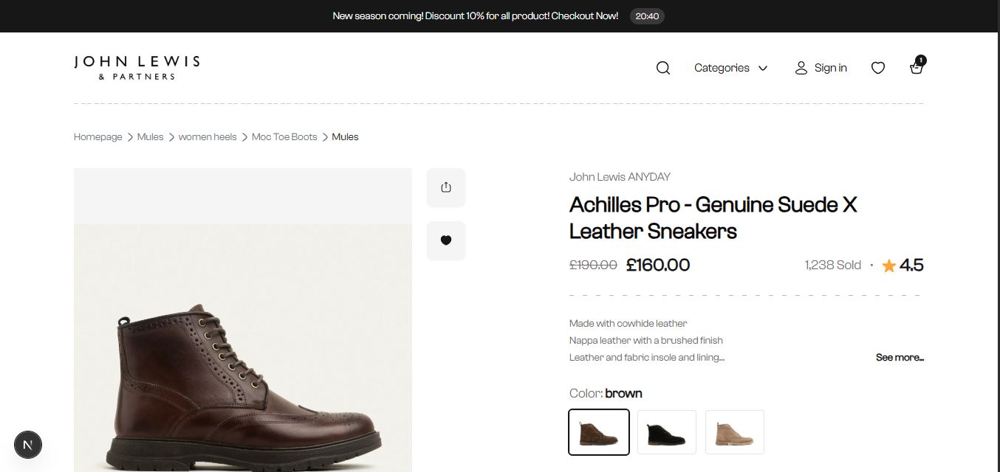
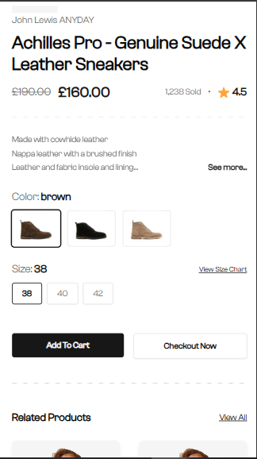
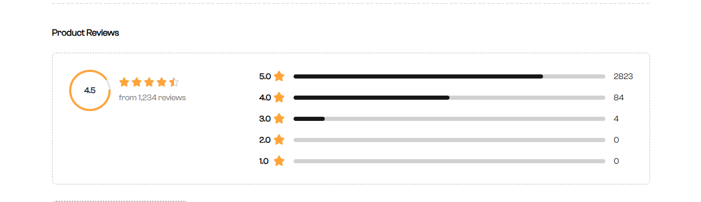
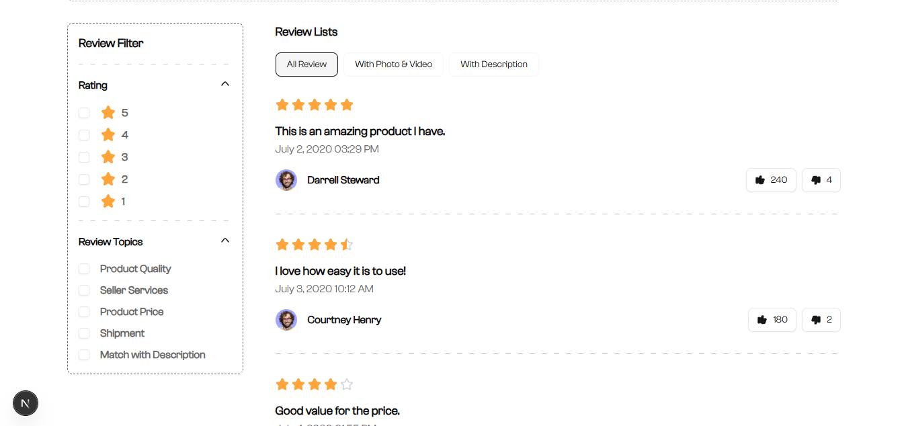
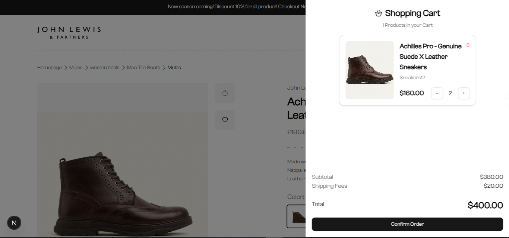
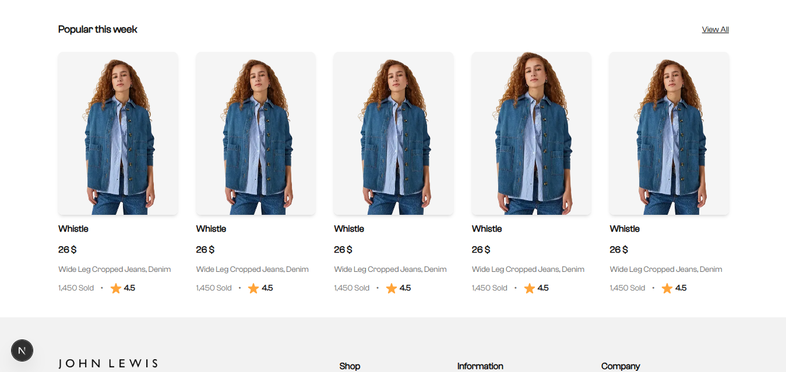

# 🛍️ E-commerce Product Detail Page

**A clean, responsive product detail page built with Next.js, TanStack React Query, Zustand, Tailwind CSS & shadcn/ui.**

Based on the task from [ElegantSoft's frontend engineeing challenge](https://github.com/ElegantSoft/frontend-task-2025) — this solution delivers a modern UI/UX experience.

---

## 🚀 Project Overview

This repository contains a fully-functional E-commerce Product Detail Page featuring:

- 📊 Product info with images, carousel, zoom, and "see more" description  
- 🛒 Cart management: add/remove items with quantity controls (with min/max + notifications)  
- ✅ Persistent cart state using **Zustand** + `persist` middleware  
- 📦 Variations (color/size), stock tracking, and dynamic subtotal/total calculation  
- ✨ Rating wheels and star rating components  
- 🙌 Social sharing integration (Facebook, Twitter, LinkedIn, WhatsApp)  
- ❤️ Wishlist functionality with Zustand store  
- 🧪 API integration using **axios** and **React Query**  
- 📱 Fully responsive UI built with **Tailwind CSS** & **shadcn/ui (Radix-based components)**

---

## 🛠️ Tech Stack

- **Next.js 14** (App Router)  
- **TypeScript**  
- **React Query** (TanStack)  
- **Zustand** (with `immer` + `persist`)  
- **Tailwind CSS** + **shadcn/ui**  
- **Sonner** for toast notifications  
- **lucide-react** for icons  
- **Axios** for API handling

---

## 🎯 Features

- **ProductCarousel**: zoom & mouse-movement interaction  
- **ProductVariations**: choose color/size dynamically  
- **ProductDescription**: expandable, collapsible with “see more…”  
- **Cart management**: persistent, quantity selector, min/max with notifications  
- **Subtotal & Total**: auto-calculated including shipping  
- **Wishlist**: add/remove favorites with persistence  
- **Social Share**: share product via popular networks  
- **Rating UI**: star-based and circular progress display  
- **Pagination**: elegant, dynamic pages with shadcn buttons  

---

## 📁 Project Structure

```
/
├─ app/                     # Next.js App Router pages and layouts
├─ components/             # UI components (ProductHeader, CartItem, etc.)
├─ hooks/                  # Custom hooks (useQuery, usePagination)
├─ stores/                 # Zustand stores (cart, wishlist)
├─ types/                  # Shared TypeScript types
├─ utils/                  # Utility functions (format, getAvailableSizes)
├─ public/                 # Static assets (images, fonts, SVGs)
├─ styles/                 # Global Tailwind and CSS
└─ README.md               # This file
```

---

## 🚧 Getting Started

1. **Clone the repo**  
   ```bash
   git clone https://github.com/Abanoob-Meseha/E-commerce-Product-Detail-Page.git
   cd E-commerce-Product-Detail-Page
   ```

2. **Install dependencies**  
   ```bash
   npm install
   ```

3. **Set environment variables** *(if needed)*  
   ```env
   NEXT_PUBLIC_API_BASE_URL=https://your-api.com
   ```

4. **Development mode**  
   ```bash
   npm run dev
   ```

5. **Production build**  
   ```bash
   npm run build
   npm start
   ```

---

## 🔗 Live Demo

🌐 Deployed on **Vercel**: [https://e-commerce-product-detail-page-abanoobmesehas-projects.vercel.app](https://e-commerce-product-detail-page-abanoobmesehas-projects.vercel.app)

---

## 📸 Screenshots

#### 🖥️ Product Detail Page (Desktop)


#### 📱 Product Variants Selection (Mobile)


#### 🌟 Product Reviews


#### 🔎 Reviews List and Filter


#### 🛒 Cart Drawer


#### 📷 Products Collection



---

## 📦 Usage Guide

- ✅ Add product to cart, quantity management
- 🎨 Choose color and size variations
- 💬 Expand/collapse long descriptions
- 🌟 Ratings and review sections with pagination
- 🔄 Cart persistence using Zustand localStorage
- 📤 Social share functionality

---

## 📜 License

MIT

---

## 🤝 Credits

This project is based on the official challenge by [ElegantSoft](https://github.com/ElegantSoft/frontend-task-2025).  
Built by [@Abanoob-Meseha](https://github.com/Abanoob-Meseha)